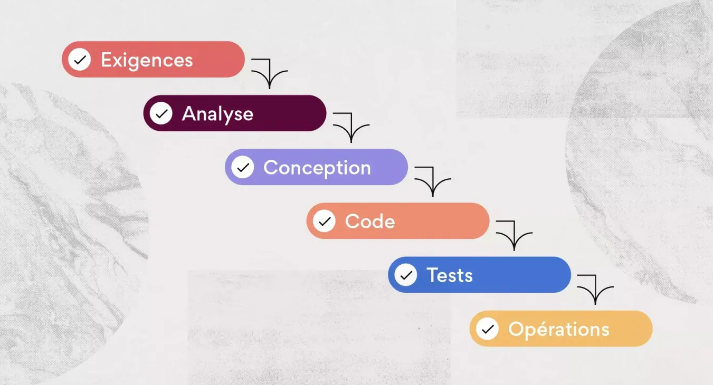
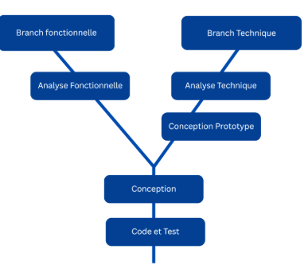
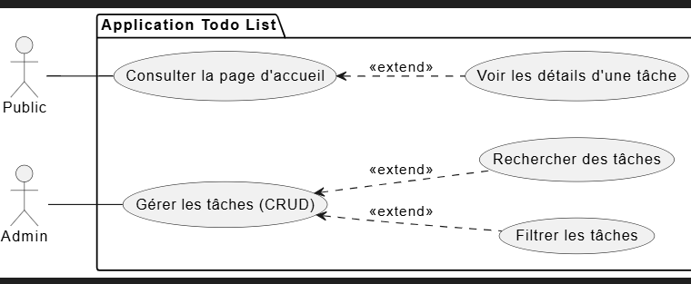
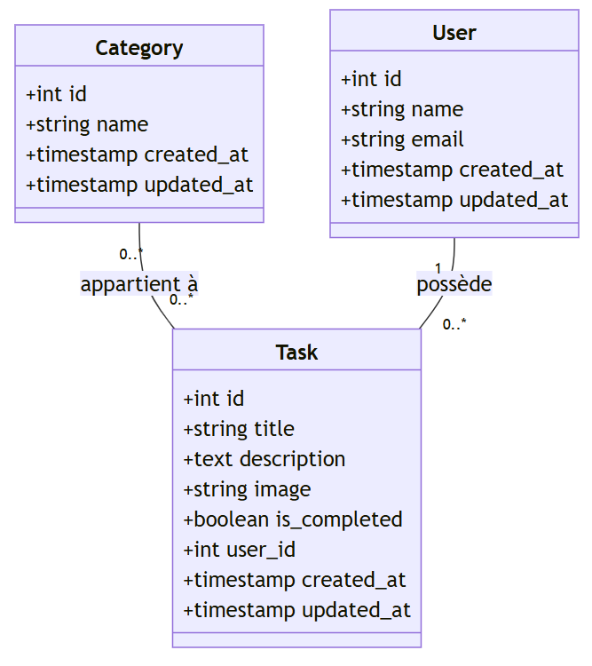

# **Présentation Projet-technique**

## Application de gestion de tâches

**Réalisé par :** Fadna Lakhouchen
**Encadré par :** M. ESSARRAJ FOUAD

---
## Choix du sujet

 gestion de tâches simple et efficace pour organiser vos activités quotidiennes.

---

## La méthode Waterfall (En cascade)

---

## Contexte
Ce projet technique a pour objectif d'appliquer les connaissances acquises et de valider notre compréhension.

#### Processus de Développement : 2TUP

---

## Technologies à Utilisée

1. **Base de données** : Mysql.
2. **Framework** : Laravel.
3. **Architecture N-tier** : Services.
4. **Architecture** : MVC.
5. **Moteur de vues** : Blade.
6. **AJAX** : Interactivité fluide sans rechargement.
7. **Gestion des Images** : Upload et stockage sécurisé.
8. **Internationalisation** : Support multilingue de l'interface.
9. **Vite** : Optimisation des performances.
10. **Preline UI** : Intégration d'un design système moderne.
11. **Lucide Library**
12. **Tailwind CSS** : Framework CSS utilitaire pour un design réactif et moderne.
---
## Fonctionnalités

---

## Conception

---

## Sujet Live Coding

- Ajouter avec un pop-up modal (AJAX).
- Rechercher les tâches.
